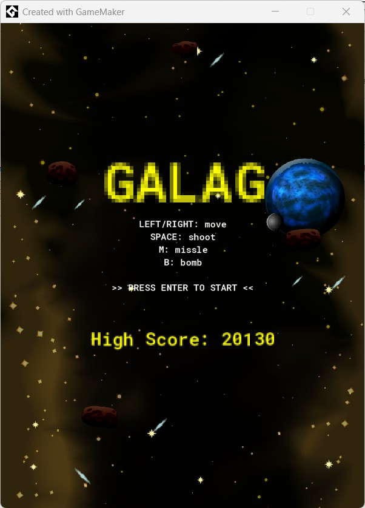
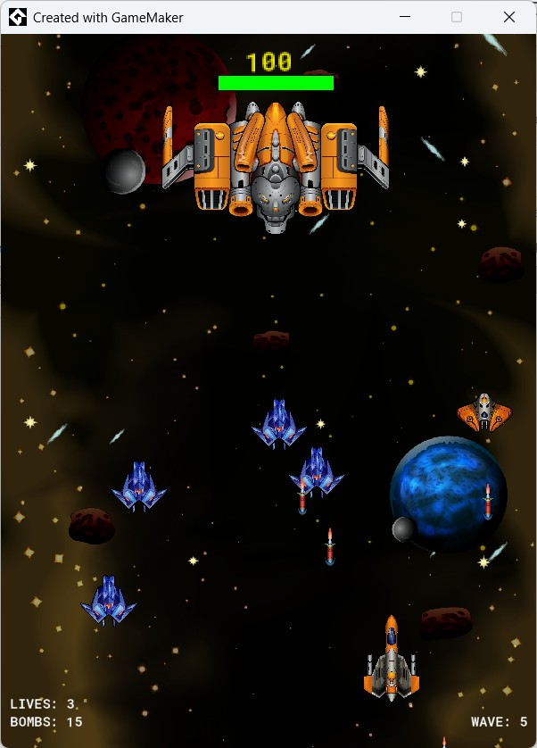

# Galag

A classic arcade-style space shooter inspired by *Galaga*, built using **GameMaker Studio 2**.

This project was created as a learning and experimentation exercise, focusing on core arcade mechanics such as player movement, enemy formations, projectile handling, collision detection, and score tracking. 
Additionally, This game supports power ups including extra live, bombs, and missiles.

---

## 🎮 Play the Game

You can play the game directly in your browser here:

👉 **Online Demo:**  
https://www.cehost.com/galag/

---

## 📸 Screenshots

### Gameplay Overview

*Startup Screen displaying player controls. This game supports keyboard and joytsick controls*

---

### Enemy Formations and Combat

*Enemies attacking in formation with player projectiles and score tracking.*

---

## 🕹️ Controls

- **Arrow Keys** – Move left and right  
- **Space Bar** – Fire weapon
- **B** - Launch a bomb
- **M** - Launch a missle
- **Joy Stick** - Support included for movement and weapon firing

(Controls may vary slightly depending on browser or platform.)

---

## 🛠️ Built With

- **GameMaker Studio 2**
- GML (GameMaker Language)

---

## 📂 Project Structure

This repository includes:
- GameMaker project files (`.yyp`, `.yy`)
- Sprites, sounds, and game assets
- Game logic written in GML
  
---

## 🎯 Goals and Learning Focus

- Classic arcade game loop design
- Enemy wave and formation logic
- Player input and movement constraints
- Collision detection and scoring
- State machine logic
- Parallax scrolling adding depth to a 2D game
- Browser deployment via GameMaker HTML5 export

---

## 🚀 Future Enhancements

Possible improvements and extensions:
- High score persistence
- Mobile-friendly controls

---

## 📜 License

This project is shared for educational and personal use.  
Refer to the repository for licensing details.

---

## 👤 Author

**Chris Chandler**  
GitHub: https://github.com/cgchandler
